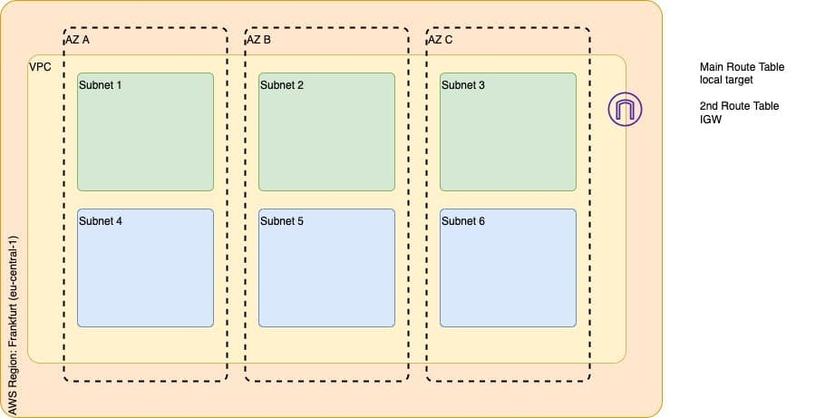

<p>
  
  
</p>

<h1 align="center">Terraform AWS VPC </h1>

### Projeto terraform para provisionar infraestrutura na AWS criando os seguintes recursos:

- 1 VPC
- 3 Zonas de disponibilidade
- 3 Subnets publicas
- 3 Subnets privadas
- 1 Internet Gateway
- 1 Route table

## 1 - Iniciar projeto.

```sh
terraform init
```

## 2 - Criar arquivo terraform.tfvars na raiz do projeto com as seguintes variaveis.

```sh
quantity = Numero de instâncias EC2
key      = Nome da chave a ser usada para conectar às instâncias
```

## 3 - Executar projeto

```sh
terraform plan
terraform apply
```

## Autor

👤 **Marcus Vinicius**

- Github: [marcusjava](https://github.com/marcusjava)
